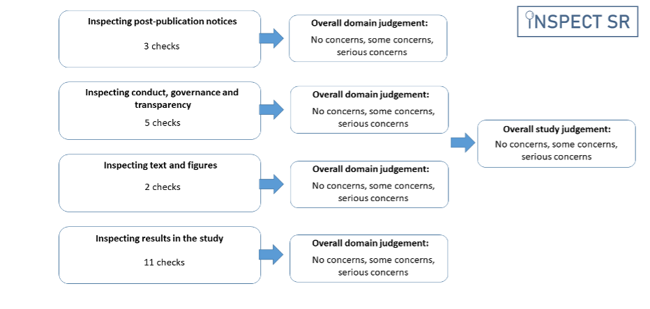

## Introduction {.unnumbered}

INSPECT-SR ([Wilkinson et al., 2025](https://doi.org/10.1101/2025.09.03.25334905)) is a tool for assessing the trustworthiness of randomised controlled trials (RCTs) in systematic reviews. It was developed for health RCTs but has utility in other fields too.

INSPECT-SR does not assess internal or external validity (which are covered by Risk of Bias tools and GRADE), nor does it cover conflicts of interest.

INSPECT-SR contains 21 checks across four domains to help the reviewer make a judgement about whether a study's data and findings can be trusted sufficiently to include it in a research synthesis.

### Accessing

- The live website version of this guidance is hosted at [https://inspect-sr.com](https://inspect-sr.com), which can also be reached via [https://inspect.sr](https://inspect.sr). Both are maintained permanently, but `inspect-sr.com` is preferred, as some institutional networks block the `.sr` domain.
- A pdf of the current version of the guidance is available: click the "PDF" button at the top left hand side of the page.

## Citation

INSPECT-SR, *including this guidance document*, should be cited using the reference for the INSPECT-SR publication:

> Wilkinson, J. D., Heal, C., Flemyng, E., Antoniou, G. A., Aburrow, T., Alfirevic, Z., Avenell, A., Barbour, V., Berghella, V., Bishop, D. V. M., Bordewijk, E. M., Brown, N. J. L., Christopher, J., Clarke, M., Dahly, D. L., Dennis, J., Dicker, P., Dumville, J., Grey, A., Grohmann, S., Gurrin, L. C., Hayden, J. A., Heathers, J. A. J., Hunter, K. E., Hussey, I., Jung, L., Lam, E., Lasserson, T. J., Lensen, S., Li, T., Li, W., Liu, J., Loder, E., Lundh, A., Meyerowitz-Katz, G., Mol, B. W., Naudet, F., Noel-Storr, A., O'Connell, N., Parker, L., Redberg, R. F., Redman, B. K., Richardson, R., Seidler, A. L., Sheldrick, K., Sydenham, E., van Wely, M., Vorland, C., Wang, R., Weibel, S., Wjst, M., Bero, L., & Kirkham, J. J. (2025) INSPECT-SR: a tool for assessing trustworthiness of randomised controlled trials. medRxiv 2025.09.03.25334905; doi: [10.1101/2025.09.03.25334905](https://doi.org/10.1101/2025.09.03.25334905)

You might also wish to include the version number of the guidance you used in the citation, which is available at the top of the home page of the website and below the list of authors on the first page of the pdf.

## Version and feedback

It is anticipated that the guidance document will be continually revised in response to feedback and ongoing monitoring of use of the tool. This will include the addition of more examples to illustrate both correct and improper use of the checks. Reviewers of the tool may provide anonymous feedback on their experience using [this survey](https://www.qualtrics.manchester.ac.uk/jfe/form/SV_eOPavZZHDZ0fvN4). This feedback will be monitored by the INSPECT-SR Study Management Group, and feedback will be used to update the guidance document. However, reviewers should not expect responses to questions posted on the feedback survey.

## Contributors

Each contributors role is listed below (e.g., contribution to the INSPECT-SR article or the guidance listed on this website).

::: {style="display: inline-block;"}
| Contributor | Article | Guidance | 
|:-----|:-------:|:--------:|
| Jack Wilkinson [](https://orcid.org/0000-0003-3513-4677) | Yes | Yes |
| Calvin Heal [](https://orcid.org/0000-0002-6445-1551) | Yes |  Yes |
| Ella Flemyng [](https://orcid.org/0000-0002-9845-9076) | Yes | Yes |
| Georgios A. Antoniou | Yes | Yes |
| Tony Aburrow | Yes | Yes |
| Zarko Alfirevic [](https://orcid.org/0000-0001-9276-518X) | Yes |  Yes |
| Alison Avenell [](https://orcid.org/0000-0003-4813-5628) | Yes | Yes |
| Virginia Barbour [](https://orcid.org/0000-0002-2358-2440) | Yes | Yes |
| Vincenzo Berghella [](https://orcid.org/0000-0003-2854-0239) | Yes | Yes |
| Dorothy V. M. Bishop [](https://orcid.org/0000-0002-2448-4033) | Yes | Yes |
| Esmée M. Bordewijk [](https://orcid.org/0000-0001-7983-1613) | Yes |  Yes |
| Nicholas J. L. Brown [](https://orcid.org/0000-0003-1579-0730) | Yes | Yes |
| Jana Christopher [](https://orcid.org/0000-0002-2699-3368) | Yes | Yes |
| Mike Clarke [](https://orcid.org/0000-0002-2926-7257) | Yes |  Yes |
| Darren Dahly [](https://orcid.org/0000-0003-0110-324X) | Yes | Yes |
| Jane Dennis [](https://orcid.org/0000-0001-9718-2653) | Yes |  Yes |
| Patrick Dicker [](https://orcid.org/0000-0002-7942-9314) | Yes | Yes |
| Jo Dumville [](https://orcid.org/0000-0002-6546-3685) | Yes |  Yes |
| Helen Frankish | Yes | Yes |
| Andrew Grey [](https://orcid.org/0000-0002-7803-0096) | Yes |  Yes |
| Steph Grohmann [](https://orcid.org/0000-0001-5640-1688) | Yes | Yes |
| Lyle C. Gurrin | Yes | Yes |
| Jill A. Hayden [](https://orcid.org/0000-0001-7026-144X) | Yes | Yes |
| James Heathers [](https://orcid.org/0000-0002-0936-026X) | Yes | Yes |
| Kylie E. Hunter [](https://orcid.org/0000-0002-2796-9220) | Yes | Yes |
| Ian Hussey [](https://orcid.org/0000-0001-8906-7559) | Yes | Yes |
| Lukas Jung [](https://orcid.org/0009-0007-9174-1494) | Yes | Yes |
| Emily Lam | Yes |  Yes |
| Toby J. Lasserson [](https://orcid.org/0000-0001-9638-2856) | Yes |  Yes |
| Sarah Lensen [](https://orcid.org/0000-0002-1694-1142) | Yes | Yes |
| Tianjing Li [](https://orcid.org/0000-0001-5371-4558) | Yes |  Yes |
| Wentao Li [](https://orcid.org/0000-0001-8980-0909) | Yes |  Yes |
| Jianping Liu [](https://orcid.org/0000-0002-0320-061X) | Yes | Yes |
| Elizabeth Loder | Yes |  Yes |
| Andreas Lundh [](https://orcid.org/0000-0002-4982-8680) | Yes |  Yes |
| Gideon Meyerowitz-Katz [](https://orcid.org/0000-0002-1156-9345) | Yes | Yes |
| Ben W. Mol [](https://orcid.org/0000-0001-8337-550X) | Yes | Yes |
| Florian Naudet [](https://orcid.org/0000-0003-3760-3801) | Yes | Yes |
| Anna Noel-Storr [](https://orcid.org/0000-0003-3476-8432) | Yes |  Yes |
| Neil E. O’Connell [](https://orcid.org/0000-0003-1989-4537) | Yes |  Yes |
| Lisa Parker | Yes |  Yes |
| Rita F. Redberg | Yes |  Yes |
| Barbara K. Redman [](https://orcid.org/0000-0001-5119-9898) | Yes |  Yes |
| Rachel Richardson [](https://orcid.org/0000-0003-2848-6260) | Yes |  Yes |
| Anna Lene Seidler [](https://orcid.org/0000-0002-0027-1623) | Yes |  Yes |
| Kyle Sheldrick [](https://orcid.org/0000-0002-2198-8025) | Yes | Yes |
| Emma Sydenham [](https://orcid.org/0000-0002-1471-4237) | Yes |  Yes |
| Madelon van Wely [](https://orcid.org/0000-0001-8263-213X) | Yes | Yes |
| Colby J. Vorland [](https://orcid.org/0000-0003-4225-372X) | Yes | Yes |
| Rui Wang [](https://orcid.org/0009-0005-1237-6376) | Yes | Yes |
| Stephanie Weibel [](https://orcid.org/0000-0003-1900-2535) | Yes | Yes |
| Matthias Wjst [](https://orcid.org/0000-0002-4974-5631) | Yes |  Yes |
| Lisa Bero [](https://orcid.org/0000-0003-1893-6651) | Yes |  Yes |
| Jamie J. Kirkham [](https://orcid.org/0000-0003-2579-9325) | Yes | Yes |
:::

## Motivation

Systematic reviews exploring health interventions aim to include all eligible studies. This will often involve, but not always exclusively focus on, randomised controlled trials (RCTs). Systematic reviews appraise and synthesise this evidence to arrive at an overall conclusion about whether an intervention is beneficial and whether it causes harm. Problematic studies pose a threat to the evidence synthesis paradigm. These are defined by Cochrane as "any published or unpublished study where there are serious questions about the trustworthiness of the data or findings, regardless of whether the study has been formally retracted". Studies may be problematic because they include some false data or results, or they may be entirely fabricated. Research misconduct is just one possible explanation for false data. Another possibility would be the presence of catastrophic failures in the conduct of the trial, such as miscoding of participants' allocated treatment (e.g., inverting active intervention and placebo groups), failure to properly randomise participants, or severe errors in the analysis code. Whether they are the result of deliberate malpractice or honest error, these issues may not be immediately apparent to journal editors and peer reviewers. Consequently, problematic studies may be published, and subsequently included in systematic reviews. Studies are, of course, routinely appraised on the basis of their methodological validity during the systematic review process. However, these assessments are predicated on the lower-level assumption that the studies and the data they are based on are authentic, and also that the authors did not make any major errors during data collection, analysis or reporting. In fact, many reports of problematic studies describe sound methodology, and so are not currently flagged by critical appraisal tools.

This prompts the question of how we can identify problematic studies. The INSPECT-SR (INveStigating ProblEmatic Clinical Trials in Systematic Reviews) tool has been developed for this purpose, using empirical evidence and consensus methodology. The development process has been described in a protocol paper and in associated results papers. The tool can be used to assess the trustworthiness of RCTs.

## Overview of the tool

The INSPECT-SR tool guides the reviewer through a series of 21 checks in four domains to help them make a judgement about the trustworthiness of a study. In this context, trustworthiness does not encompass internal or external validity, as assessed using Risk of Bias tools and GRADE, nor does it include conflicts of interest. The four domains in the tool are:

| Domain | Focus |
|--------|-------|
| **Domain 1** | Inspecting post-publication notices |
| **Domain 2** | Inspecting conduct, governance and transparency |
| **Domain 3** | Inspecting text and figures |
| **Domain 4** | Inspecting results in the study |

The checks in each domain assist the systematic reviewer in identifying any domain-level concerns relating to trustworthiness. The reviewer may then use the domain-level judgement to arrive at an overall judgement about the trustworthiness of a trial. We emphasise that concerns about a trial's trustworthiness do not amount to an accusation of misconduct. INSPECT-SR is not concerned with determining whether inauthentic data have arisen due to deliberate misconduct or honest error.

## Application of the tool to assess an individual study

[Download template](../files/Editable%20template%20for%20INSPECT-SR.docx){.btn .btn-primary download="Editable template for INSPECT-SR.docx"}

Reviewers are advised to use the checks in each domain to arrive at a domain-level judgement about trustworthiness. The tool does not use a prescriptive algorithm to produce a domain-level judgement from the checks in the domain. For each domain, the reviewer records a judgement of **"no concerns"**, **"some concerns"**, or **"serious concerns"**. The purpose of the tool is to identify potentially problematic studies, and a reviewer may decide they have sufficient concerns about a study without having completed all of the checks included in the tool. For efficiency, the reviewer could terminate the assessment of a study if they consider a judgement of "serious concerns" to be warranted at any point during the assessment. This conclusion could be reached before all domains have been assessed. Furthermore, the reviewer might decide that they have serious concerns in relation to a particular domain having completed only a subset of the checks in that domain. In this situation, it would not be necessary to complete the remaining checks in the domain. This differs from Risk of Bias tools, where the expectation is that all domains should be assessed for each study.

A response of "Yes" to an individual check should not generally automatically trigger a judgement of "serious concerns", but may do so if the check reveals a problem that is sufficient to compromise the trustworthiness of the study. Having made a judgement in relation to all four domains (or having reached a judgement of "serious concerns" in relation to any of the first three, if the reviewer has opted to terminate the assessment on this basis) the reviewer is required to make an overall judgement about the trustworthiness of the trial, again using the options "no concerns", "some concerns", or "serious concerns". It is expected that the overall judgement for a trial will typically be at least as severe as the judgement for the domain with the most severe rating. For example, where an assessment has been terminated following a rating of 'serious concerns' or a full assessment has been completed but one domain has been rated as "serious concerns", it is expected that the overall study judgement will also be one of "serious concerns". If the most severe domain-level judgement is "some concerns", then it is expected that the overall study-level judgement should be at least "some concerns", but the cumulative impact of judging there to be "some concerns" in several domains may be sufficient to warrant an overall judgement of "serious concerns" for the study, if the reviewer considers the totality of the concerns to substantially lower confidence in the study’s trustworthiness. Reviewers should report the reasons for their domain and study-level judgements, to permit scrutiny. INSPECT-SR assessments should be reported in the appropriate section of the systematic review (e.g. in characteristics of included or excluded studies), to ensure transparency.

A trial may be reported across several publications, including conference abstracts, preprints, protocol papers, and secondary analysis papers. As for Risk of Bias assessment, it will typically be necessary to consider all of the publications describing the trial to obtain the information necessary to complete the checks. The final check in the tool explicitly asks the reviewer to consider whether there are any contradictions in information reported in different publications relating to the index trial.

## Incorporating the tool into the systematic review process

As is expected for other aspects of a systematic review, such as Risk of Bias assessment and data extraction, it is recommended that two reviewers first apply INSPECT-SR independently before comparing their assessments and reaching agreement in relation to any areas of disagreement. To address some domains content knowledge is necessary (for example, to consider items relating to biological plausibility). For other domains, a level of statistical competence, if not expertise, will likely be needed to consider numerical data from the study. Some familiarity with clinical trial design, conduct and analysis will be useful in making judgements. We recommend that the INSPECT-SR tool is applied prior to Risk of Bias assessment of eligible randomised trials, regardless of which Risk of Bias tool is used for this purpose. This is because any trial judged to warrant "serious concerns", should not be included in the review, meaning there is no need to assess Risk of Bias for these trials. Trials that receive a study-level judgement of "some concerns" should not be automatically excluded from the review or left out of the synthesis entirely, but it is recommended that these studies should be subjected to sensitivity analysis to determine their influence on the results and conclusions of the review. As for Risk of Bias assessment, there are several possibilities for how this could be operationalised, and systematic review teams should specify their approach at the protocol stage. Possibilities include: 1) restricting the primary analysis to trials with a study-level judgement of "no concerns", and including studies with a study-level judgement of "some concerns" in a sensitivity analysis; and 2) including studies with a study-level judgement of "some concerns" in the primary analysis with studies with "no concerns", and then performing a sensitivity analysis restricted to studies with a study-level judgement of "no concerns".

A judgement of "serious concerns" is intended to be used only when there are features of the study that, either alone or in combination, warrant serious doubts about the trustworthiness of the study. On reaching a judgement of "serious concerns", we recommend reviewing the check responses leading to this judgement to confirm that it is reasonable and justifiable as there may be an alternative explanation, such as journal word limits restricting what can be reported. "Serious concerns" should only be used if it is clear, beyond reasonable doubt, that there truly are serious concerns. As with other aspects of data extraction and critical appraisal of studies during the conduct of a systematic review, correspondence with study authors is strongly recommended to clarify points of uncertainty in relation to trustworthiness assessment. If the individual participant data (IPD) can be accessed, it is possible to perform a more thorough trustworthiness assessment. If there are uncertainties remaining after application of INSPECT-SR, it is recommended to request the IPD from study authors in order to confirm or assuage concerns. An extension to INSPECT-SR that can be used for this purpose, INSPECT-IPD, is in development. Templates for reporting trustworthiness concerns to journals are available on [Cochrane's website](https://www.cochranelibrary.com/cdsr/editorial-policies/problematic-studies-implementation-guidance#7-1).

## Guidance on the use of individual checks in the INSPECT-SR tool

The following describes key points to consider in relation to individual checks in the INSPECT-SR tool. Illustrative examples are provided. There are four response options corresponding to each check: **"Yes"**, **"No"**, **"Unclear"**, **"Not Applicable"**. Checks have been worded such that a positive response ("Yes") corresponds to a potentially problematic feature of a study. Domain-level judgements do not follow from check responses in a deterministic or algorithmic fashion. For example, we have not specified a threshold corresponding to the number of checks that should be answered "Yes" to trigger domain-level judgements of "serious concerns". The purpose of the checks is to help the reviewer reach a domain-level judgement about whether or not they have concerns about trustworthiness, and to articulate a basis for that judgement. In some cases, a "Yes" response for a single check might be sufficient to trigger serious concerns for the domain and therefore for the study, depending on the nature and extent of the problem identified. However, a reviewer should not automatically assign a judgement of "serious concerns" on the basis that one or more checks were answered "Yes".

It is necessary to record and report some explanatory text detailing the reason for each check response in the appropriate section of the review. Depending on whether or not the trial is included or excluded, this should be in the characteristics of included or excluded studies tables. Some of the checks may be difficult to assess without topic expertise, and a comprehensive assessment is likely to require input from a review team with content and statistical method expertise; although the tool does not require any advanced statistical analyses, the ability to perform and interpret some basic statistical tests is required for some checks, and an understanding of key features of clinical trial processes, such as randomisation procedures, is useful to assess compatibility between reported methods and results. It is recommended to have two team members undertake the assessment independently, and to then discuss and agree on judgements. It might be useful to have team members with complementary skill sets undertake the assessment, as problems might be detected by a reviewer with a particular area of expertise. We use the term "index study" to refer to the study being assessed using the INSPECT-SR tool.

As the field evolves (see the [changelog](appendices/changelog.qmd)), freely available automated or AI-driven tools to facilitate (some of) these checks may become available. We recommend reviewers are cautious and critique these tools before use to ensure they are fit for purpose. Consider public details about the automation embedded within the tools, clear terms and conditions for use, public and transparent evaluations, and clarity on the strengths, limitations, biases and generalisability. It is recommended that any automation or AI used in evidence synthesis adheres to the RAISE (Responsible AI in Evidence Synthesis) recommendations and guidance for responsible AI use in evidence synthesis. If reviewers would like to suggest automated or AI-driven tools that meet these standards and could be added to this guidance, please provide details using [this survey](https://www.qualtrics.manchester.ac.uk/jfe/form/SV_eOPavZZHDZ0fvN4).

## License

&copy; Jack Wilkinson (2025-2026)

Text and figures are licensed under a [Creative Commons Attribution 4.0 (CC BY 4.0)](https://creativecommons.org/licenses/by/4.0/) license.

Code is licensed under the [MIT License](https://opensource.org/licenses/MIT).

You are free to copy, share, adapt, and reuse the contents of this website — text, figures, and code — for any purpose, including commercial use, provided you cite it.

## Source code and archival

This site is maintained by Ian Hussey and Jack Wilkinson. If you find issues etc, you can open an issue or pull request on the [GitHub repository](https://github.com/ianhussey/inspect-sr-guidance). The GitHub repository is archived on [Zenodo](https://doi.org/10.5281/zenodo.21905597). Technically, this guidance document has its own DOI and reference, listed below, but please cite the INSPECT-SR publication itself (see Citation section above).

<!-- Jack Wilkinson, Calvin Heal, Ella Flemyng, Georgios A. Antoniou, Tony Aburrow, Zarko Alfirevic, Alison Avenell, Virginia Barbour, Vincenzo Berghella, Dorothy V. M. Bishop, Esmée M Bordewijk, Nicholas J. L. Brown, Jana Christopher, Mike Clarke, Darren Dahly, Jane Dennis, Patrick Dicker, Jo Dumville, Helen Frankish, Andrew Grey, Steph Grohmann,Lyle C. Gurrin, Jill A. Hayden, James Heathers, Kylie E Hunter, Ian Hussey, Lukas Jung, Emily Lam, Toby J. Lasserson, Sarah Lensen, Tianjing Li, Wentao Li, Jianping Liu, Elizabeth Loder, Andreas Lundh, Gideon Meyerowitz-Katz, Ben W. Mol, Florian Naudet, Anna Noel-Storr, Neil E. O’Connell, Lisa Parker, Rita F. Redberg, Barbara K. Redman, Rachel Richardson, Anna Lene Seidler, Kyle Sheldrick, Emma Sydenham, Madelon van Wely, Colby J. Vorland, Rui Wang, Stephanie Weibel, Matthias Wjst, Lisa Bero, & Jamie J. Kirkham (2026).  -->

Wilkinson, J., Heal, C., Flemyng, E., Antoniou, G. A., Aburrow, T., Alfirevic, Z., Avenell, A., Barbour, V., Berghella, V., Bishop, D. V. M., Bordewijk, E. M., Brown, N. J. L., Christopher, J., Clarke, M., Dahly, D., Dennis, J., Dicker, P., Dumville, J., Frankish, H., Grey, A., Grohmann, S., Gurrin, L. C., Hayden, J. A., Heathers, J., Hunter, K. E., Hussey, I., Jung, L., Lam, E., Lasserson, T. J., Lensen, S., Li, T., Li, W., Liu, J., Loder, E., Lundh, A., Meyerowitz-Katz, G., Mol, B. W., Naudet, F., Noel-Storr, A., O'Connell, N. E., Parker, L., Redberg, R. F., Redman, B. K., Richardson, R., Seidler, A. L., Sheldrick, K., Sydenham, E., van Wely, M., Vorland, C. J., Wang, R., Weibel, S., Wjst, M., Bero, L., & Kirkham, J. J. (2026). INSPECT-SR Guidance. website: [inspect-sr.com](https://inspect-sr.com/). doi: [10.5281/zenodo.21905597](https://doi.org/10.5281/zenodo.21905597)

## Resources

- [Editable template](appendices/template.html) — a Word document template for recording and reporting INSPECT-SR assessments
- [Feedback survey](https://www.qualtrics.manchester.ac.uk/jfe/form/SV_eOPavZZHDZ0fvN4) — provide anonymous feedback on your experience with the tool
- [Retraction Watch database](http://retractiondatabase.org/) — search for retractions and post-publication notices
- [PubPeer](https://www.pubpeer.com/) — post-publication peer review comments
- [Cochrane implementation guidance](https://www.cochranelibrary.com/cdsr/editorial-policies/problematic-studies-implementation-guidance#7-1) — templates for reporting trustworthiness concerns to journals
- [The Collection of Open Science Integrity Guides (COSIG)](https://cosig.net/) — guides for how to apply various trustworthiness assessment methods and how to effectively report problematic studies to 
- [trustworthy.scientific.claims](https://trustworthy.scientific.claims) — A hub for forensic meta-science tool development

